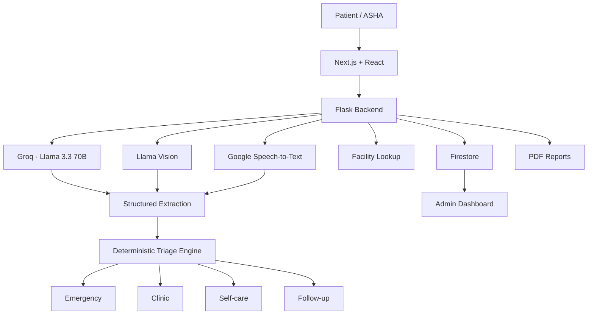

<div align="center">


<p>
  <a href="https://aarogyabot.vercel.app">
    
  </a>
  <a href="https://github.com/prathamkariya/AarogyaBot">
    
  </a>
</p>

**AI-assisted triage • Multilingual care • Actionable healthcare navigation**

</div>

---

## What is AarogyaBot?

AarogyaBot is a multilingual health-triage platform designed to help users describe symptoms, clarify incomplete cases, estimate urgency, and find nearby healthcare facilities.

It supports three experiences:

<table>
<tr>
<td width="33%" align="center">

### Patient

Describe symptoms, use text/image/voice input, receive triage guidance, locate facilities and generate reports.

</td>
<td width="33%" align="center">

### ASHA Worker

Triage patients through a dedicated workflow with urgency filters, symptom context and patient history.

</td>
<td width="33%" align="center">

### Admin

View district-level triage activity, urgency distribution, top symptoms and recent emergencies.

</td>
</tr>
</table>

> **Core idea:** the LLM handles language understanding; explicit application rules handle the final urgency classification.

---

## The idea

```text
User
 ↓
Text / Image / Voice
 ↓
AI extraction
 ↓
Structured symptoms + severity signals
 ↓
Deterministic triage engine
 ├── Emergency
 ├── Clinic
 ├── Self-care
 └── Follow-up
 ↓
Guidance + nearby facilities
 ↓
Optional health report
```

This separation keeps the final decision path explicit instead of asking an LLM to directly decide everything.

---

## How it works

### 01 — Understand

For text input, **Llama 3.3 70B via Groq** extracts symptoms, language and severity indicators into structured data.

For incomplete inputs, `TriageSession` maintains conversation history and can ask up to two follow-up questions.

### 02 — Decide

The structured result goes through the rule engine in `backend/triage.py`.

```text
Emergency signals
      ↓
  EMERGENCY

Clinic signals
      ↓
    CLINIC

Enough information + no escalation
      ↓
   SELF-CARE

Insufficient information
      ↓
   FOLLOW-UP
```

### 03 — Act

The result can trigger:

- nearby healthcare facility lookup
- emergency / clinic guidance
- voice and multilingual responses
- PDF triage reports
- ASHA workflow integration
- aggregate admin analytics

---

## Architecture



---

## Multilingual by design

The interface currently supports:

<p align="center">


</p>

Language selection is passed through the triage flow so follow-up questions and responses can stay aligned with the selected language.

---

## Input → Intelligence

<table>
<tr>
<td align="center"><b>Text</b><br/>Symptom extraction<br/>+ follow-up reasoning</td>
<td align="center"><b>Image</b><br/>Vision-assisted<br/>symptom analysis</td>
<td align="center"><b>Voice</b><br/>Speech-to-text<br/>→ normal triage</td>
</tr>
</table>

All three paths converge into the same structured triage layer.

```text
          ┌── Text ────┐
          │             │
Input ────┼── Image ───┼──→ Structured extraction
          │             │
          └── Voice ───┘
                         ↓
                  Rule-based triage
                         ↓
                  Actionable result
```

---

## Tech stack

<p align="center">
  
</p>

<p align="center">
  
  
  
  
</p>

| Layer | Technologies |
|---|---|
| **Frontend** | Next.js 16, React 19, TypeScript, Tailwind CSS, Recharts |
| **Backend** | Python, Flask, Flask-CORS, Gunicorn |
| **AI** | Groq, Llama 3.3 70B, Llama Vision |
| **Data** | Firebase Firestore, CSV-based symptom/facility data |
| **Services** | Google Cloud Speech-to-Text, geospatial facility lookup |
| **Reporting** | fpdf2 |

---

## Project structure

```text
AarogyaBot/
├── backend/
│   ├── app.py
│   ├── triage.py
│   ├── conversation.py
│   ├── llm_service.py
│   ├── report.py
│   └── *.csv
│
├── frontend/
│   ├── app/
│   ├── components/
│   │   ├── aarogya/
│   │   └── ui/
│   ├── src/lib/
│   └── public/
│
└── README.md
```

---

## Run locally

### Backend

```powershell
git clone https://github.com/prathamkariya/AarogyaBot.git
cd AarogyaBot/backend

python -m venv .venv
.venv\Scripts\Activate.ps1
pip install -r requirements.txt
python app.py
```

Create `backend/.env`:

```env
GROQ_API_KEY=your_groq_api_key
```

### Frontend

```bash
cd frontend
npm install
npm run dev
```

Set the backend URL in `frontend/.env.local`:

```env
NEXT_PUBLIC_API_URL=http://localhost:5001
```

Open:

**http://localhost:3000**

---

## Demo

The frontend currently includes demo accounts for the two protected flows.

```text
ASHA
asha@demo.com
asha1234

ADMIN
admin@demo.com
admin1234
```

These are local demo credentials, not production authentication.

---

## Engineering notes

### Graceful degradation

When the Groq client is unavailable, the backend has a keyword-based fallback extraction path using the local symptom data.

### Conversation state

Active `TriageSession` objects are currently held in memory. Persistent session storage would be needed for a distributed production deployment.

### Prototype data

The ASHA patient list and health-record screens currently contain demo data. Persistent healthcare records and stronger server-side authorization would be required for production use.

### Safety boundary

AarogyaBot is an **AI-assisted triage tool, not a diagnostic system**. It should not replace qualified medical advice.

---

## Why this project?

AarogyaBot combines several systems into one end-to-end workflow:

```text
LLM
 +
Vision
 +
Speech
 +
Rule engine
 +
Conversation state
 +
Facility discovery
 +
Analytics
 +
PDF generation
        ↓
End-to-end health triage platform
```

The interesting engineering boundary is simple:

> **Use AI to understand. Use explicit logic to decide. Use software to act.**

---

## Roadmap

- Persistent distributed sessions
- Stronger server-side authentication and RBAC
- Automated multilingual evaluation
- Expanded emergency-rule test coverage
- Persistent health records
- Observability and rate limiting
- Better localized PDF reports

---

<div align="center">


**Built by Team Stetharos · PDEU**

<a href="https://aarogyabot.vercel.app">Live Demo</a>
&nbsp;·&nbsp;
<a href="https://github.com/prathamkariya/AarogyaBot">GitHub</a>

</div>
