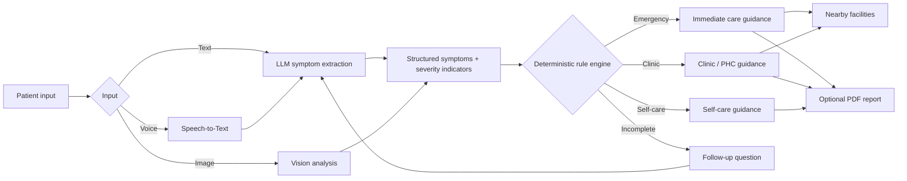
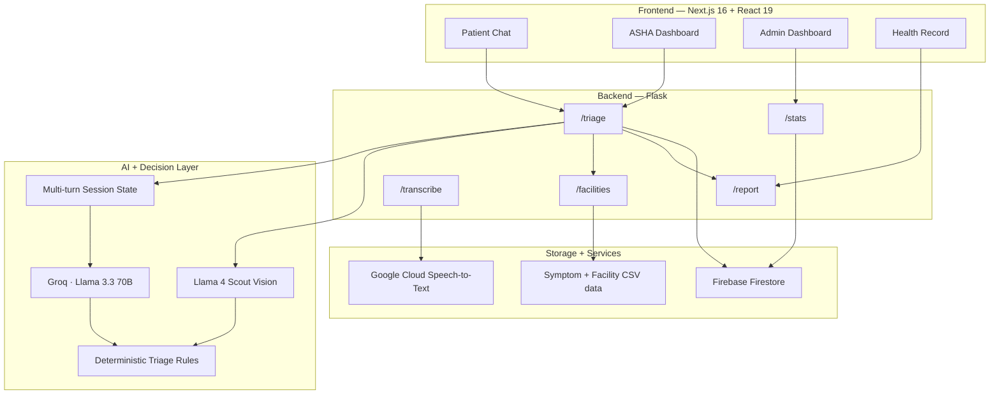

# AarogyaBot

<div align="center">


# AarogyaBot

### Multilingual AI health triage built for first-line care

<p>
  <a href="https://aarogyabot.vercel.app"></a>
  
  
  
  
  
</p>

<p>
AarogyaBot takes a patient's symptoms in a natural, conversational way, asks targeted follow-up questions when a case is incomplete, separates <b>emergency</b>, <b>clinic</b>, and <b>self-care</b> cases, and connects the result to nearby healthcare facilities.
</p>

</div>

---

## Preview

> Add your screenshots to `docs/screenshots/`. The README is already wired to display them.

<table>
<tr>
<td width="50%">

### Patient Triage


</td>
<td width="50%">

### ASHA Worker View


</td>
</tr>
<tr>
<td width="50%">

### District Dashboard


</td>
<td width="50%">

### Health Record


</td>
</tr>
</table>

<p align="center">
  
</p>

<p align="center"><sub>Recommended: 4–5 polished screenshots rather than a long gallery.</sub></p>

---

## What is AarogyaBot?

AarogyaBot is a multilingual health-triage application designed around the first stage of care: understanding symptoms, estimating urgency, and helping the user reach an appropriate healthcare facility.

The system has three main user flows:

| User | What they can do |
|---|---|
| **Patient** | Describe symptoms, answer follow-up questions, use image/voice input, view triage guidance, find nearby facilities, generate a PDF report |
| **ASHA Worker** | Triage patients through a worker-focused dashboard, maintain patient context, review symptoms, and access facility guidance |
| **Admin** | View aggregate triage activity, urgency distribution, top symptoms, and recent emergency cases |

The key architectural decision is that the LLM is **not the final authority on urgency**. It extracts symptoms and severity signals; a deterministic rule engine performs the final emergency/clinic/self-care classification.

---

## Core workflow



### The decision boundary

AarogyaBot uses the LLM for **understanding**, not for making the final triage decision.

The backend extracts structured signals such as:

```text
chest pain
breathing difficulty
unconsciousness
severe bleeding
seizures
stroke signs
head injury
poisoning
animal/snake bite
high fever
severe abdominal pain
blood in stool/vomit
pregnancy-related warning signs
```

These signals then move through a deterministic classifier:

```text
Emergency indicator present
        ↓
    EMERGENCY

No emergency indicator
        ↓
Clinic indicator / clinic symptom
        ↓
      CLINIC

No clinic signal
        ↓
Enough information?
   ├── No  → follow-up question
   └── Yes → SELF-CARE
```

This makes the final decision path explicit and inspectable instead of allowing an LLM response to directly determine urgency.

---

## System architecture



---

## How the AI pipeline works

### 1. Text symptom extraction

Text input is sent to **Llama 3.3 70B through Groq**.

The model is instructed to return structured JSON containing:

- detected language
- normalized symptoms
- severity indicators
- whether follow-up is needed
- one short follow-up question when information is incomplete

The prompt explicitly defines the assistant as a **triage assistant rather than a diagnostic system**.

### 2. Multi-turn follow-up

Short or vague inputs such as:

```text
"I feel sick"
"tabiyat kharab hai"
```

can trigger a follow-up instead of an immediate final classification.

`TriageSession` keeps conversation history, tracks follow-up count, and can ask up to two clarification questions before classifying the case with the information available.

```text
User message
    ↓
Extract symptoms
    ↓
Enough information?
 ┌───────────────┐
 │               │
 No              Yes
 │               │
 ↓               ↓
Ask follow-up   Classify
 │               │
 └──────→────────┘
```

### 3. Rule-based urgency classification

The core classifier lives in `backend/triage.py`.

It checks:

1. Emergency indicators
2. Clinic indicators
3. Clinic-tier symptom keywords
4. Pending follow-up state
5. Self-care guidance

The result returned to the frontend contains the triage tier, message, symptoms, language, confidence, and next steps.

---

## Multilingual support

The application supports:

| Language | Code |
|---|---|
| English | `en` |
| Hindi | `hi` |
| Gujarati | `gu` |
| Marathi | `mr` |
| Tamil | `ta` |

Language selection is passed through the frontend and backend so that triage responses and follow-up questions can be produced in the selected language.

The fallback extraction path also detects Devanagari, Gujarati, and Tamil scripts when the LLM is unavailable.

---

## Image triage

AarogyaBot supports image input in addition to text.

The backend sends the image to a vision-capable Llama model and requests structured output containing:

```text
condition name
explanation
recommendation
symptoms
visual description
severity indicators
follow-up requirement
```

The extracted result is then processed by the same deterministic classification layer.

This gives the system a common path:

```text
Text ──────┐
Image ─────┼──→ Structured extraction ──→ Rule engine ──→ Triage result
Voice ─────┘
```

---

## Voice input

Voice recordings are sent to:

`POST /transcribe`

The backend uses **Google Cloud Speech-to-Text** with India-specific language codes:

```text
English  → en-IN
Hindi    → hi-IN
Gujarati → gu-IN
Tamil    → ta-IN
Marathi  → mr-IN
```

The generated transcript is then passed into the normal text-triage pipeline.

---

## Nearby healthcare facilities

For emergency and clinic cases, the application can locate nearby healthcare facilities from the user's latitude and longitude.

Facility records include:

```text
name
type
district
state
phone
open_hours
has_emergency
latitude
longitude
maps_url
```

The backend computes geographic distance and returns the closest matching facilities.

That turns a generic result such as:

```text
"You should seek medical care."
```

into an actionable next step:

```text
Nearest facility
→ Distance
→ Phone
→ Opening hours
→ Maps
```

---

## Patient, ASHA, and Admin workflows

### Patient

```text
Open AarogyaBot
      ↓
Choose language
      ↓
Describe symptoms
      ↓
Answer follow-up if needed
      ↓
Receive triage result
      ↓
View next steps
      ↓
Find nearby facility
      ↓
Generate report
```

### ASHA Worker

The ASHA dashboard provides a separate workflow for community health workers.

The current frontend includes:

- patient list
- urgency filters
- search and sorting
- patient-specific triage sessions
- symptom context
- facility lookup
- patient history views

The worker can therefore use the same triage engine through a more operational interface.

### Admin

The admin dashboard reads aggregate data from the backend and refreshes it periodically.

It can display:

- total triages
- emergency count
- urgency distribution
- top symptoms
- recent emergency cases

---

## Health records and reports

The health-record interface provides a structured patient view with:

- patient summary
- current urgency
- visit history
- symptom timeline
- doctor references
- medication information

Completed triage data can also be converted into a PDF report.

The generated report can contain:

```text
Report metadata
        ↓
Triage classification
        ↓
Reported symptoms
        ↓
Recommendation
        ↓
Nearest facilities
        ↓
Emergency helplines
        ↓
Safety disclaimer
```

The backend generates these reports using `fpdf2`.

---

## API surface

| Method | Endpoint | Purpose |
|---|---|---|
| GET | `/health` | Backend health check |
| POST | `/triage` | Text/image triage and session handling |
| POST | `/triage/reset` | Reset a triage session |
| GET | `/facilities` | Return nearby healthcare facilities |
| GET | `/stats` | Aggregate triage statistics |
| POST | `/transcribe` | Voice transcription |
| POST | `/report` | Generate a PDF triage report |

Flasgger is initialized in the Flask application for API documentation.

---

## Tech stack

### Frontend

```text
Next.js 16
React 19
TypeScript
Tailwind CSS
Recharts
Radix UI
```

### Backend

```text
Python
Flask
Flask-CORS
Flasgger
Gunicorn
```

### AI

```text
Groq
Llama 3.3 70B
Llama 4 Scout Vision
```

### Data and services

```text
Firebase Firestore
Google Cloud Speech-to-Text
CSV symptom datasets
CSV healthcare facility dataset
```

### Reporting

```text
fpdf2
```

---

## Repository structure

```text
AarogyaBot/
├── backend/
│   ├── app.py
│   ├── conversation.py
│   ├── triage.py
│   ├── llm_service.py
│   ├── report.py
│   ├── symptoms_final.csv
│   ├── symptoms_v3_with_ta_gu.csv
│   ├── clinics_allstates_v2.csv
│   └── requirements.txt
│
├── frontend/
│   ├── app/
│   ├── components/
│   │   ├── aarogya/
│   │   │   ├── landing-page.tsx
│   │   │   ├── public-chat.tsx
│   │   │   ├── asha-dashboard.tsx
│   │   │   ├── admin-dashboard.tsx
│   │   │   ├── health-record.tsx
│   │   │   ├── triage-card.tsx
│   │   │   └── ...
│   │   └── ui/
│   ├── public/
│   │   ├── logo.png
│   │   └── ...
│   └── package.json
│
└── README.md
```

---

## Local development

### 1. Clone

```bash
git clone https://github.com/prathamkariya/AarogyaBot.git
cd AarogyaBot
```

### 2. Backend

```powershell
cd backend
python -m venv .venv
.venv\Scripts\Activate.ps1
pip install -r requirements.txt
python app.py
```

The Flask application listens on **port 5001** when launched directly from `app.py`.

Create:

`backend/.env`

```env
GROQ_API_KEY=your_groq_api_key
```

Optional integrations:

```text
FIREBASE_KEY
GOOGLE_CLOUD_CREDENTIALS
```

### 3. Frontend

```bash
cd frontend
npm install
npm run dev
```

The frontend runs on:

`http://localhost:3000`

Set the backend URL in:

`frontend/.env.local`

```env
NEXT_PUBLIC_API_URL=http://localhost:5001
```

### 4. Open

```text
http://localhost:3000
```

---

## Demo accounts

The current frontend includes local demo authentication.

### ASHA

```text
Email:    asha@demo.com
Password: asha1234
```

### Admin

```text
Email:    admin@demo.com
Password: admin1234
```

These credentials are intended for the demo frontend and are not production authentication credentials.

---

## Adding screenshots

Create:

```text
docs/
└── screenshots/
    ├── patient-chat.png
    ├── triage-result.png
    ├── asha-dashboard.png
    ├── admin-dashboard.png
    └── health-record.png
```

### Recommended screenshot set

| File | Capture |
|---|---|
| `patient-chat.png` | Main patient chat and language selection |
| `triage-result.png` | A clean emergency/clinic/self-care result |
| `asha-dashboard.png` | Patient queue + worker workflow |
| `admin-dashboard.png` | Charts and aggregate health statistics |
| `health-record.png` | Patient history and symptom timeline |

Use consistent browser dimensions and crop away browser chrome where possible.

A good README usually needs **a handful of strong screenshots**, not dozens. Keep the most important interface first.

---

## Important engineering notes

### LLM fallback

If the Groq client is unavailable, the backend falls back to keyword matching against the local symptom dataset. This provides graceful degradation instead of making the entire triage endpoint depend on a successful LLM request.

### Conversation state

Active `TriageSession` objects are currently stored in application memory and keyed by session ID.

That is convenient for the prototype, but a distributed production deployment would need persistent session storage.

### Firestore

Firestore is optional in the current backend. When it is not configured, the service can still run and returns fallback analytics values.

### Demo data

The ASHA patient list and health-record view currently contain frontend demo data. This makes the interface easy to demonstrate, but those sections should be backed by real persistent records before being treated as a production health-record system.

### Medical safety

AarogyaBot is an **AI-assisted triage tool, not a diagnostic system**. It should not be presented as a replacement for qualified medical care.

---

## Project design

The strongest architectural idea in AarogyaBot is the separation between:

```text
Probabilistic understanding
        ↓
Structured extraction
        ↓
Deterministic decision logic
        ↓
Actionable workflow
```

Instead of:

```text
User
 ↓
LLM
 ↓
"Trust the answer"
```

The system creates a clearer boundary between language understanding and safety-critical application logic.

The rest of the application then builds around that boundary:

```text
Natural language
      +
Vision
      +
Speech
      +
Rule engine
      +
Conversation state
      +
Facility lookup
      +
Analytics
      +
PDF reporting
      ↓
End-to-end triage workflow
```

---

## Roadmap

Potential next improvements:

- persistent sessions for horizontally scaled deployments
- stronger server-side authentication and role enforcement
- real routing/travel-time data for facility navigation
- automated evaluation of multilingual extraction quality
- broader tests for emergency indicator coverage
- persistent health records instead of demo patient data
- observability, rate limiting, and request tracing
- better localization for generated reports

---

## Team

Built by **Team Stetharos, PDEU**.

---

## Disclaimer

AarogyaBot is an AI-assisted health-triage and navigation application. It does not provide a medical diagnosis and should not replace advice from a qualified healthcare professional. For emergencies, seek immediate professional medical assistance.

---

<div align="center">

### AarogyaBot

Multilingual triage · Human-centered workflows · AI-assisted decision support

<a href="https://aarogyabot.vercel.app">Live Demo</a>
&nbsp;·&nbsp;
<a href="https://github.com/prathamkariya/AarogyaBot">Repository</a>

</div>
